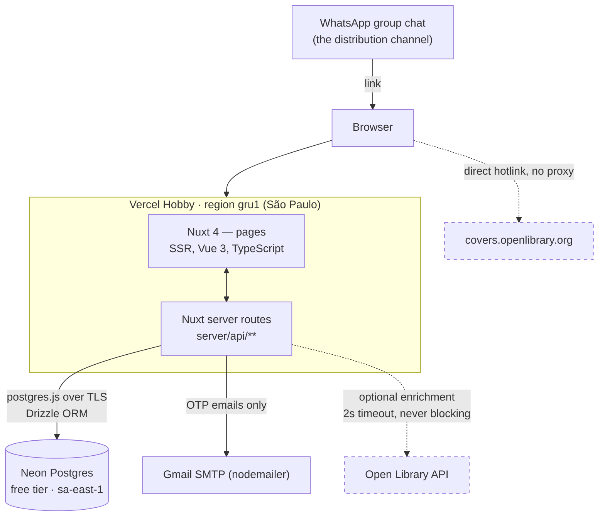

# Architecture

Decision record for the meus-livros MVP. Written 2026-09-18, after the discovery phase in [product-discovery.md](product-discovery.md).

---

## 1. System overview



Everything solid is on the critical path. Everything dashed can fail without the product failing.

**Request flow, concretely.** A friend taps a link in the group chat → Vercel runs the Nuxt SSR handler in São Paulo → the handler calls a service in `server/services/` → the service queries Neon through Drizzle → HTML comes back with correct `og:*` meta tags. No client-side data fetch is required for any public page to render.

---

## 2. Architectural principles

1. **TypeScript-first.** One language across pages, server routes and scripts. `strict: true`.
2. **PostgreSQL is the source of truth.** Everything the product depends on lives in Neon. Nothing is derived from a third party at read time.
3. **External catalog is enrichment, never dependency.** Open Library improves a record when it answers. The product works identically when it does not. This is a measurement-driven rule, not a preference — see §6.
4. **One project, one deploy.** Pages and API in the same Nuxt app. No separate backend, no separate repo, no BFF.
5. **Authorization lives in server code, in one place.** Every read of a user-owned table goes through a single visibility helper. No RLS, no policies, no second mental model.
6. **Secure by default.** Reviews are plain text — there is no HTML to sanitise. Private means private at the query level, not hidden in the UI.
7. **Incremental migration.** The existing static site keeps working, in `legacy/`, until the new app reaches parity. No big-bang rewrite.
8. **No premature scaling.** Designed for ~30–300 users and ~10k reading logs. Ceilings are documented in [architecture-review.md](architecture-review.md), not engineered around.
9. **Measure before optimising.** Every performance decision in this document traces to a number that was actually observed.

---

## 3. Stack decisions and trade-offs

### 3.1 Framework — Nuxt 4

**Recommendation: Nuxt 4** (Vue 3, TypeScript, file-based routing, Nitro server).

| Alternative | Why not |
|---|---|
| Keep Vue 3 via CDN | Cannot server-render. WhatsApp's crawler does not execute JavaScript, so no link preview — which kills the only distribution channel |
| Vite + Vue SPA + small server | Same SSR problem, solved worse: you end up hand-rolling what Nitro gives free, in two deploy units |
| SvelteKit / Next.js | Discards the existing Vue code and the owner's familiarity for no product gain |
| Astro | Excellent for the public pages, awkward for the authenticated app. Two paradigms in one MVP |

**Main downside:** the existing `index.html` does **not** port over verbatim. It is one 421-line `setup()` block with no component boundaries; decomposing it into `BookCard`, `StarRating`, `FilterBar`, `BookModal` and `ReadingMap` is real work — budget it honestly in [tasks/005](tasks/005-port-design-tokens-and-components.md) rather than pretending the framework migration is free.

**Why acceptable:** SSR is not optional. The one hard requirement of this product — a link that previews in a group chat — cannot be met by a client-rendered app at any price.

**Also decided:** the GeoChart reading map (`index.html:12,170,336`) is a third-party CDN script driven by direct DOM manipulation. It is not SSR-safe. It gets wrapped in `<ClientOnly>` with a lazy loader, or replaced by a static SVG map. This is named work, not an afterthought.

### 3.2 Rendering — plain SSR everywhere

**Recommendation: SSR on every route. No ISR, no static prerendering, no SPA-shell split.**

The temptation is to add ISR for the public OG-critical routes. Do the arithmetic first: 30 users, generously 2,000 page views a month, is roughly **0.2% of Vercel Hobby's 1,000,000 monthly invocations**. A cache saves nothing measurable and costs a great deal: a cached page cannot show the viewer's own session, so read-your-own-write breaks; and rendering a cacheable route with a user session is how one friend's `privado` review ends up served to the whole group.

One rendering mode. `Cache-Control: private, no-store` on anything rendered with a session.

**Revisit when:** monthly invocations exceed ~200,000, or p95 TTFB on `/livro/{slug}` exceeds 800ms.

### 3.3 Database — Neon, not Supabase

**Recommendation: Neon free tier**, Postgres 17, region closest to São Paulo.

This overturns the discovery documents, which specified Supabase. The reason is operational, not technical:

| | Supabase free | Neon free |
|---|---|---|
| Idle behaviour | **Pauses after 7 days**, requires a **manual dashboard restore** taking minutes ([Supabase](https://supabase.com/pricing)) | Autosuspends after 5 min, **resumes automatically in <1s** ([Neon](https://neon.com/docs/introduction/plans)) |
| Projects | 2 | 100, with 10 branches each |
| Storage | 500 MB | 0.5 GB per project |
| Compute | always-on small instance | 100 CU-hours/project/month ≈ 400 h at 0.25 CU |

A friend group's usage is *intermittent by nature* — that is the definition of the workload. A database that goes down after a quiet week and stays down until someone opens a dashboard is the wrong shape for it, and the discovery doc's proposed mitigation (a GitHub Actions keep-alive cron) is itself fragile: GitHub disables scheduled workflows after 60 days without commits on public repositories.

Choosing Neon deletes the pause, the keep-alive cron, the monitoring of that cron, and the 60-day workflow problem — four moving parts removed by one choice.

**Main downside:** no bundled auth, storage or PostgREST. We need none of them (see §3.5). **Also:** Neon's free compute is metered in CU-hours; a runaway query loop could exhaust 100 CU-hours. At this scale it will not, and the dashboard shows usage.

### 3.4 Query layer — Drizzle + postgres.js

**Recommendation: Drizzle ORM with the `postgres.js` driver.**

| Alternative | Why not |
|---|---|
| Prisma | A generated engine binary and a separate schema language. Heavier than a 10-table MVP needs |
| Kysely | Excellent query builder, but no migration story — we would bolt one on |
| Raw `postgres.js` | Viable and tempting. Loses compile-time column typing across ~10 tables and hand-rolls migration ordering |
| `supabase-js` / PostgREST | Moot once Supabase is out. It also constrains the Portuguese-collation `ILIKE` search to what PostgREST exposes |

Drizzle wins on three concrete things this project needs: TypeScript types derived from the schema with no codegen step, migrations as plain committed SQL, and a trivial escape hatch to raw SQL for the unaccented search query.

**Main downside:** smaller ecosystem than Prisma, and its relational query API is younger. **Why acceptable:** the schema is ten tables with ordinary foreign keys; nothing here stresses an ORM.

**Connection note:** serverless functions must not hold a pool. Configure `postgres(url, { max: 1 })` and let Neon's pooled connection string do the pooling. Use the **pooled** endpoint for the app and the **direct** endpoint for migrations and `pg_dump`.

### 3.5 Authentication — better-auth with email OTP

**Recommendation: better-auth, email one-time codes delivered by Gmail SMTP (via nodemailer). No OAuth in the MVP.**

This overturns the discovery documents, which specified Google OAuth as primary. The reason is decisive:

> **Google returns `403: disallowed_useragent` for OAuth initiated inside an embedded WebView**, a policy in force since 2017 and fully enforced since 2021. WhatsApp's Android in-app browser is such a WebView. Brazil is overwhelmingly Android.

The distribution channel is WhatsApp. Sign-in that fails inside WhatsApp fails at the exact moment of activation. The workarounds — user-agent sniffing, an "abra no navegador" interstitial, `intent://` links to Chrome — are three pieces of fragile machinery guarding a path that a 6-digit email code simply does not have.

Email OTP works in every browser, embedded or not. It also collapses the registration gate into the same field: **the allowlist is a table of emails, and the login identifier is an email.** One concept.

| Alternative | Why not |
|---|---|
| Google OAuth | Fails in the WhatsApp WebView. Also needs a Google Cloud project and a published consent screen (unpublished apps expire refresh tokens every 7 days) |
| Magic links | Same idea, worse ergonomics: the link opens in a different browser than the one that requested it, orphaning the session. A 6-digit code is copy-pasteable |
| Supabase Auth | Moot once Supabase is out. Its built-in mailer is also capped at 2 messages/hour project-wide |
| Roll our own sessions | No |

**Sending-provider reversal (Resend → Gmail SMTP):**

The original specification named Resend. It was reversed after real sends failed with two HTTP 403s:

1. `The gmail.com domain is not verified` — Resend requires a DNS-verified sending domain (SPF/DKIM). The maintainer owns no domain for this project and sends from an `@gmail.com` address, whose DNS belongs to Google.
2. `You can only send testing emails to your own email address` — without a verified domain, Resend blocks every recipient except the account holder.

The product authenticates directly against **Gmail SMTP via `nodemailer`**, using a Google app password (`GMAIL_APP_PASSWORD`). Because Google’s own infrastructure does the sending, SPF and DKIM pass naturally. A personal Gmail account allows 500 messages/day — ample for a cohort of ~30.

**The cost of this choice, stated plainly:** with no dedicated domain, deliverability rides on Gmail’s reputation and a code can land in the recipient’s promotions tab or spam folder. If the project ever acquires a domain, moving to a dedicated transactional provider is worth revisiting.

### 3.6 Authorization — server code, not RLS

**Recommendation: no row-level security. One visibility helper in server code.**

This overturns [product-discovery.md](product-discovery.md) §13.1 and `feature-backlog.md` PRIV-1, both of which mandate RLS. Those were written assuming a Supabase architecture where a browser-side client talks to PostgREST directly — in that world RLS is the only boundary and is mandatory.

That is not this architecture. Every database access originates in a trusted Nuxt server route holding a verified session. The app connects as a single role. RLS in that setup is enforced against code that already knows who the viewer is — it adds a second place where authorization lives, in a second language, with policies that are harder to test than a TypeScript function.

**The rule, and it is the only one:** every query that reads a user-owned table goes through `visibleTo(viewer)`. An ESLint `no-restricted-imports` rule keeps the raw `db` handle out of `app/` and out of route files.

**Main downside:** a direct `psql` session bypasses all of it. **Why acceptable:** the only people with the connection string are the owner and CI.

### 3.7 Search — local Postgres `ILIKE`

**Recommendation: `ILIKE` over a generated, unaccented, lowercased column. No `tsvector`, no `pg_trgm`, no Elasticsearch.**

At ~1,500 works this is a sub-millisecond sequential scan. Portuguese dictionary configuration, GIN indexes and ranking are all engineering for a corpus three orders of magnitude larger than this one.

One implementation detail that will otherwise cost an afternoon: `unaccent()` is `STABLE`, not `IMMUTABLE`, so `GENERATED ALWAYS AS (lower(unaccent(title))) STORED` is **rejected by Postgres**. Wrap it:

```sql
CREATE FUNCTION f_unaccent(text) RETURNS text
  AS $$ SELECT public.unaccent('public.unaccent', $1) $$
  LANGUAGE sql IMMUTABLE STRICT;
```

**Revisit when:** the works table passes ~50,000 rows, or search latency exceeds 100ms.

### 3.8 Book catalog — the community, with Open Library as enrichment

**Recommendation: the `works`/`editions` tables are the catalog. Manual entry is a primary path. Open Library is an optional, non-blocking enrichment.**

This is the largest departure from the discovery documents, and it is entirely measurement-driven. Against 30 real Brazilian editions from `livros.json`:

| Measurement | Result |
|---|---|
| Edition record exists by ISBN | **12 / 30 (40%)** |
| Cover exists by ISBN | 17 / 30 (57%) |
| Title+author search returns ≥1 result | ~22 / 30 |
| **Search latency** | **avg 8.4s, range 2.5s–21s, with hard timeouts** |

Harry Potter (Rocco): 5 of 7 missing. Percy Jackson (Intrínseca): 4 of 5 missing. *Histórias da meia-noite* by Machado de Assis: zero results.

An 8.4-second average makes Open Library unusable in a search box, and 40% coverage makes it unusable as an authority. Full strategy in [book-catalog.md](book-catalog.md).

**The network effect that makes this work:** a book added by hand by one friend is immediately available to the other 29. At 30 readers × ~50 books, the local catalog becomes genuinely useful within weeks.

### 3.9 Hosting — Vercel Hobby

**Recommendation: Vercel Hobby, Nitro `vercel` preset, `regions: ["gru1"]`.**

| Alternative | Why not |
|---|---|
| Cloudflare Workers/Pages | Free plan caps CPU per invocation, which SSR + auth can plausibly exceed; Pages is in maintenance mode in favour of Workers Static Assets. Its advantages (unlimited bandwidth, commercial use) are both irrelevant here |
| Netlify free | Perfectly viable second choice. Vercel's Nitro preset is zero-config |
| A VPS | Something to operate, patch and monitor. Explicitly against principle 8 |

Vercel Hobby is **licensed for non-commercial use only**. This project is a free, ad-free reading diary for 30 friends — squarely within that. **If the product is ever monetised, this decision must be revisited**; it is recorded in [open-questions.md](open-questions.md).

### 3.10 Analytics — one table

**Recommendation: a `search_misses` table. Nothing else.**

The discovery doc proposed a 15-event taxonomy. Most of those events are already columns: `signed_up` is `users.created_at`; `book_logged` is `reading_logs.created_at`. The metric that decides this project — *how many friends logged three books in the first month* — is a `GROUP BY` over `reading_logs`.

What is **not** derivable from existing tables is the searches that returned nothing, and that single signal directly tests the biggest product assumption (that the local-catalog-plus-manual-add model is good enough). So that is the one thing instrumented.

### 3.11 Testing — Vitest, narrow

**Recommendation: Vitest. Unit tests for pure logic, integration tests for exactly four things.**

The four: the visibility helper (público/privado, own vs other viewer), rating validation (0.5–5.0 in 0.5 steps, server-side), ISBN-10→13 normalisation, and the `livros.json` migration script against the real 86 rows.

No E2E framework, no coverage threshold, no component snapshot tests. A solo developer shipping to 30 friends gets more safety from four sharp integration tests than from a 70% coverage gate.

---

## 4. What we are explicitly not building

Named here so nobody adds them by reflex. Full reasoning in [architecture-review.md](architecture-review.md).

Redis · Elasticsearch · message queues · background job workers · microservices · a separate API repo · CQRS · event sourcing · RLS · ISR/edge caching · a CDN we operate · Docker in production · Kubernetes · a design system library · GraphQL · WebSockets · feature flags · a staging environment · ML recommendations · follows · a paginated feed · notifications · lists · likes · want-to-read · a statistics page · SEO/sitemaps · author/genre/country browse pages · Goodreads import.

The last nine are *product* deferrals from [mvp-definition.md](mvp-definition.md), not architectural ones; each is additive and changes no existing table.

---

## 5. Where this architecture breaks

| Ceiling | Breaks at | What to do |
|---|---|---|
| `ILIKE` search | ~50k works | Add `tsvector` + GIN with the `portuguese` config |
| Neon free storage (0.5 GB) | ~500k logs | Neon Launch tier (~US$5/mo) |
| Neon free compute (100 CU-h) | sustained real traffic | Same |
| Vercel Hobby invocations (1M/mo) | ~30k daily page views | Vercel Pro, or move to Netlify/a VPS |
| Vercel Hobby licence | **the day it earns money** | Vercel Pro |
| SSR with no cache | p95 TTFB > 800ms | Add ISR on the four public routes, with on-demand revalidation |
| No follows | ~200 users | Add a `follows` table and a feed filter; purely additive |
| No merge tooling for duplicate works | ~50 duplicates | Build a merge UI; until then, hand-written SQL |
| Gmail SMTP (500 emails/dia) | ~500 sign-ins/dia | Domínio próprio + provedor transacional dedicado (ex: Resend com DNS configurado) |

None of these is engineered around today. Each is a monitored number with a known response.
