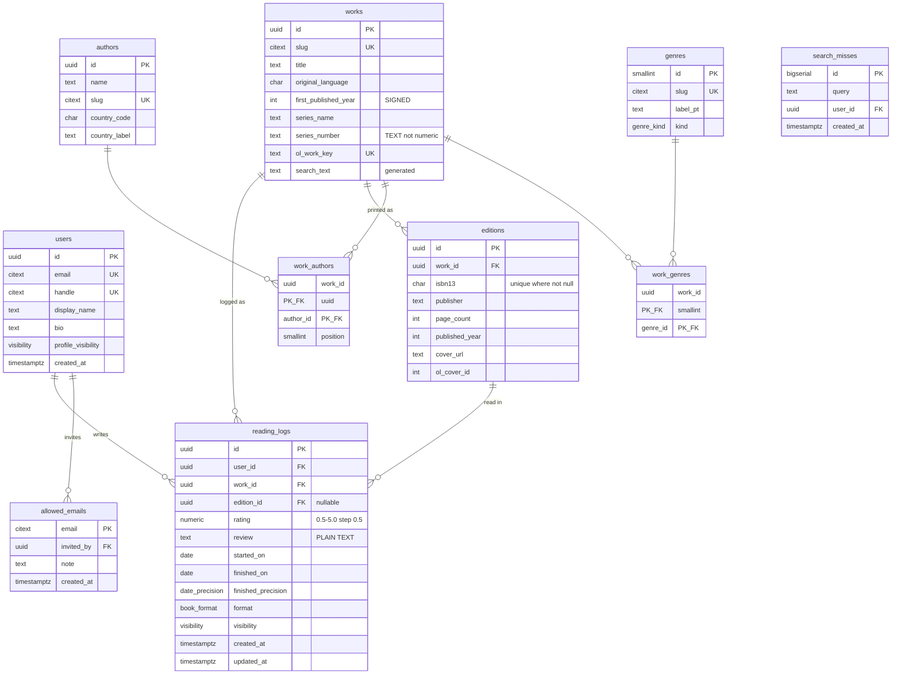

# Database

Postgres 17 on Neon. Drizzle ORM. Ten application tables plus better-auth's own.

`server/db/schema.ts` is the single source of truth; the SQL here is the shape it must produce. Migrations are generated with `drizzle-kit generate` and committed.

---

## 1. Work vs Edition vs Reading Log

The decision this schema exists to get right. Ask these in order — **first YES wins, then stop**:

1. **Would two people who read different *translations* still agree on this value?** → **Work**
2. Otherwise: **Would this change if I bought a different *printing*, and my opinion stayed identical?** → **Edition**
3. Otherwise: **Would another reader holding the *same physical copy* disagree with me about this?** → **Reading Log**

### Every field in `livros.json`, placed

| `livros.json` field | Entity | Reasoning |
|---|---|---|
| `title` | Work | A Brazilian and an English reader name the same book |
| `author` | Work (via `work_authors` → `authors`) | Invariant under translation |
| `country` | **Author** | It describes the writer, not the book. Verified: no author in the corpus has more than one country |
| `original_language` | Work | Definitionally a property of the original |
| `year` | Work (`first_published_year`) | First publication of the work. **Signed integer** — the corpus contains `-500` |
| `publisher` | Edition | The whole point of the distinction |
| `pages` | Edition | Varies by printing |
| `isbn` | Edition | Identifies a printing, never a work |
| `cover_url` | Edition | A cover belongs to a printing |
| `series_name`, `series_number` | Work | Position in a sequence survives translation |
| `genre` | Work (via `work_genres`) | A translation does not change a book's genre |
| `read_in` | **Reading Log** (`finished_on` + `finished_precision`) | A reading event |
| `rate` | **Reading Log** | Two readers of one copy disagree — that is the whole product |
| `review` | **Reading Log** | Same |
| `source` (Físico/Ebook) | **Reading Log** (`format`) | *How I consumed it*, not what the publisher made. Keeping it here avoids forking the catalog into near-duplicate physical/ebook rows — the exact pattern that makes Open Library's edition data painful |

### The two rules that follow

**`reading_logs.edition_id` is nullable, and null is the normal case.** The logging flow is: search → pick a **work** → rate, date, review → save. An edition picker exists as a collapsed "li outra edição?" control that most people never open. Forcing a bibliographic choice at the emotional peak of finishing a book is the highest-friction thing you can insert into the activation path, and activation is the whole game at 30 users.

**There is no `UNIQUE (user_id, work_id)` on `reading_logs`.** Re-reads are not a feature; they are the *absence* of that constraint. Reading *O Hobbit* in 2016 at 4.0 and again in 2024 at 5.0 is two independent rows, each with its own permalink, date, review and visibility. This is what Goodreads structurally cannot represent.

---

## 2. ER diagram



---

## 3. DDL

### Extensions and enums

```sql
CREATE EXTENSION IF NOT EXISTS citext;
CREATE EXTENSION IF NOT EXISTS unaccent;

-- unaccent() is STABLE, so it cannot be used directly in a generated column.
-- Postgres rejects it with "generation expression is not immutable".
CREATE FUNCTION f_unaccent(text) RETURNS text
  AS $$ SELECT public.unaccent('public.unaccent', $1) $$
  LANGUAGE sql IMMUTABLE STRICT PARALLEL SAFE;

CREATE TYPE visibility      AS ENUM ('publico', 'privado');
CREATE TYPE date_precision  AS ENUM ('dia', 'mes', 'ano');
CREATE TYPE book_format     AS ENUM ('fisico', 'ebook', 'audio');
CREATE TYPE genre_kind      AS ENUM ('ficcao', 'nao_ficcao', 'outro');
```

### Identity

```sql
CREATE TABLE users (
  id                 uuid PRIMARY KEY DEFAULT gen_random_uuid(),
  email              citext NOT NULL UNIQUE,
  handle             citext NOT NULL UNIQUE,
  display_name       text   NOT NULL,
  bio                text,
  profile_visibility visibility NOT NULL DEFAULT 'publico',
  created_at         timestamptz NOT NULL DEFAULT now(),
  CONSTRAINT handle_format CHECK (handle ~ '^[a-z0-9_]{3,20}$')
);

CREATE TABLE allowed_emails (
  email      citext PRIMARY KEY,
  invited_by uuid REFERENCES users(id) ON DELETE SET NULL,
  note       text,
  created_at timestamptz NOT NULL DEFAULT now()
);
```

`handle` is restricted to `[a-z0-9_]` — no accents. Brazilian names are transliterated at sign-up (`joão` → `joao`). Reserved handles (`livro`, `entrada`, `app`, `api`, `entrar`, `admin`, `sobre`) are rejected in application code, not by constraint.

better-auth creates and owns its own `session`, `account` and `verification` tables. Do not hand-write them; let its CLI generate them into the same migration journal.

### Catalog — shared, never user-owned, never private

```sql
CREATE TABLE authors (
  id            uuid PRIMARY KEY DEFAULT gen_random_uuid(),
  name          text   NOT NULL,
  slug          citext NOT NULL UNIQUE,
  country_code  char(2),
  country_label text,
  created_by    uuid REFERENCES users(id) ON DELETE SET NULL,
  created_at    timestamptz NOT NULL DEFAULT now()
);

CREATE TABLE works (
  id                  uuid PRIMARY KEY DEFAULT gen_random_uuid(),
  slug                citext NOT NULL UNIQUE,
  title               text   NOT NULL,
  original_language   char(2),
  first_published_year integer,          -- SIGNED: the corpus contains -500
  series_name         text,
  series_number       text,              -- TEXT: real values include '1-2' and '0.1'
  ol_work_key         text UNIQUE,
  created_by          uuid REFERENCES users(id) ON DELETE SET NULL,
  created_at          timestamptz NOT NULL DEFAULT now(),
  search_text         text GENERATED ALWAYS AS (f_unaccent(lower(title))) STORED
);
CREATE INDEX works_search_idx ON works (search_text text_pattern_ops);

CREATE TABLE work_authors (
  work_id   uuid NOT NULL REFERENCES works(id)   ON DELETE CASCADE,
  author_id uuid NOT NULL REFERENCES authors(id) ON DELETE CASCADE,
  position  smallint NOT NULL DEFAULT 0,
  PRIMARY KEY (work_id, author_id)
);
CREATE INDEX work_authors_author_idx ON work_authors (author_id);

CREATE TABLE editions (
  id             uuid PRIMARY KEY DEFAULT gen_random_uuid(),
  work_id        uuid NOT NULL REFERENCES works(id) ON DELETE CASCADE,
  isbn13         char(13),
  publisher      text,
  page_count     integer CHECK (page_count IS NULL OR page_count > 0),
  published_year integer,
  language       char(2),
  cover_url      text,
  ol_cover_id    integer,
  created_by     uuid REFERENCES users(id) ON DELETE SET NULL,
  created_at     timestamptz NOT NULL DEFAULT now()
);
-- PARTIAL unique: "no ISBN" must be a repeatable legal state, not a collision.
CREATE UNIQUE INDEX editions_isbn13_key ON editions (isbn13) WHERE isbn13 IS NOT NULL;
CREATE INDEX editions_work_idx ON editions (work_id);
```

`series_number` being `text` is not a stylistic choice. The real corpus contains `'1-2'` (a Pollyanna omnibus) and `'0.1'` (an Asimov prequel). A `numeric` column fails the migration.

`publisher` is free text, not a `publishers` table — 46 distinct values over 86 books and no publisher page anywhere in the roadmap. Cost: `Cia. das Letras` and `Companhia das Letras` will coexist. Accepted.

### Genres

```sql
CREATE TABLE genres (
  id       smallint PRIMARY KEY,
  slug     citext NOT NULL UNIQUE,
  label_pt text   NOT NULL,
  kind     genre_kind NOT NULL
);

CREATE TABLE work_genres (
  work_id  uuid     NOT NULL REFERENCES works(id)  ON DELETE CASCADE,
  genre_id smallint NOT NULL REFERENCES genres(id) ON DELETE RESTRICT,
  PRIMARY KEY (work_id, genre_id)
);
```

A lookup table, not a Postgres enum and not `text[]`. An enum needs `ALTER TYPE` — a schema migration and a deploy — for what is editorial data, and cannot carry a slug and a display label. `text[]` cannot be referentially constrained, which is exactly how the current data drifted to 26 labels against a 15-entry taxonomy.

Seeded from `generos.txt`, reconciled with the 26 labels actually present. `kind` captures the two-level structure the data already has implicitly: `Ficção` (73 books) and `Não-Ficção` (12) are used as top-level classifiers alongside sub-genres. Full mapping in [migration.md](migration.md).

### The atomic unit

```sql
CREATE TABLE reading_logs (
  id                 uuid PRIMARY KEY DEFAULT gen_random_uuid(),
  user_id            uuid NOT NULL REFERENCES users(id)    ON DELETE CASCADE,
  work_id            uuid NOT NULL REFERENCES works(id)    ON DELETE RESTRICT,
  edition_id         uuid          REFERENCES editions(id) ON DELETE SET NULL,
  rating             numeric(2,1),
  review             text,                        -- PLAIN TEXT. Never HTML.
  started_on         date,
  finished_on        date,
  finished_precision date_precision NOT NULL DEFAULT 'dia',
  format             book_format,
  visibility         visibility NOT NULL DEFAULT 'publico',
  created_at         timestamptz NOT NULL DEFAULT now(),
  updated_at         timestamptz NOT NULL DEFAULT now(),

  CONSTRAINT rating_half_star CHECK (
    rating IS NULL OR (rating >= 0.5 AND rating <= 5.0 AND (rating * 2) = trunc(rating * 2))
  ),
  CONSTRAINT dates_ordered CHECK (
    started_on IS NULL OR finished_on IS NULL OR started_on <= finished_on
  )
  -- Deliberately NO unique(user_id, work_id): that constraint is what breaks re-reads.
);

CREATE INDEX reading_logs_user_idx    ON reading_logs (user_id, finished_on DESC NULLS LAST);
CREATE INDEX reading_logs_work_idx    ON reading_logs (work_id);
CREATE INDEX reading_logs_public_idx  ON reading_logs (created_at DESC) WHERE visibility = 'publico';
```

`ON DELETE RESTRICT` on `work_id` is deliberate: deleting a catalog row that people have logged against should fail loudly, not silently destroy diary entries.

### Minimal instrumentation

```sql
CREATE TABLE search_misses (
  id         bigserial PRIMARY KEY,
  query      text NOT NULL,
  user_id    uuid REFERENCES users(id) ON DELETE SET NULL,
  created_at timestamptz NOT NULL DEFAULT now()
);
```

The only signal not derivable from the tables above. It tests the biggest product assumption: that a community-built catalog plus manual entry is good enough.

---

## 4. Visibility

Two tables carry `visibility`; the catalog carries none — a book is not a secret, only the fact that *you* read it is.

| Table | Column | Default |
|---|---|---|
| `users` | `profile_visibility` | `publico` |
| `reading_logs` | `visibility` | `publico` |

**One rule, no override semantics:**

> A reading log is visible to a viewer if `log.user_id = viewer.id`, **or** (`log.visibility = 'publico'` **and** `author.profile_visibility = 'publico'`).

A private profile hides every entry regardless of the entry's own setting. There is no state where a público entry on a privado profile leaks.

The default is `publico` and that matters more than the feature. With only two levels, `privado` must be an escape hatch for one embarrassing book — if new accounts defaulted to private, the social product would have nothing to show and the loop would never start.

Enforcement is a single server-side helper (see [api.md](api.md) §3), not RLS. Reasoning in [architecture.md](architecture.md) §3.6.

---

## 5. Deletion behaviour

| Relationship | On delete | Why |
|---|---|---|
| `users` → `reading_logs` | CASCADE | Deleting an account removes its diary |
| `users` → `allowed_emails.invited_by` | SET NULL | The invite record outlives the inviter |
| `users` → `works.created_by` / `authors.created_by` / `editions.created_by` | SET NULL | Catalog rows are shared property and survive their contributor |
| `works` → `reading_logs` | **RESTRICT** | Never silently destroy someone's diary entry |
| `works` → `editions` / `work_authors` / `work_genres` | CASCADE | Meaningless without their work |
| `editions` → `reading_logs.edition_id` | SET NULL | The log survives; it just stops naming a printing |
| `genres` → `work_genres` | RESTRICT | Genres are curated; deleting one in use should fail |

No soft deletes. No `deleted_at`. A 30-person trusted cohort with `pg_dump` backups does not need an audit trail, and soft deletion would put a `WHERE deleted_at IS NULL` on every query forever.

---

## 6. Deliberate simplifications

| Simplification | What it costs |
|---|---|
| No `publishers` table | Publisher aggregation runs over dirty free text |
| No `series` table | Cannot list a series' works that nobody has read; only 23 of 86 books have series data |
| No cached counts (`avg_rating`, `log_count`) | Every work page runs an aggregate. At ~10k logs with the indexes above these are sub-millisecond |
| No merge tooling for duplicate works | Duplicates from manual adds are fixed with hand-written SQL. Becomes real work at ~50 duplicates |
| No review edit history | An edit overwrites. No audit trail |
| `started_on` NULL for all 86 imported rows | Reading-duration statistics start empty and only fill from natively-logged books |
| No `follows`, `lists`, `likes`, `shelf_items` tables | Deferred product features. **All four are purely additive** — they change no existing table, which is why deferring them is safe |
| ISO codes in the DB, pt-BR labels in a frontend map | A second UI language would need the maps duplicated. The product is explicitly pt-BR-only |

---

## 7. Migration conventions

- Generated with `drizzle-kit generate`, **committed to git**, applied with `drizzle-kit migrate`.
- Applied from the maintainer's machine against the **direct** (non-pooled) Neon endpoint. Not from CI — a solo maintainer with one environment does not need a schema deployment pipeline.
- Never edit an applied migration. Add a new one.
- Every migration must be reviewed for whether it locks a table. At this size nothing will, but the habit is free.
- `schema.ts` is the source of truth. Hand-written SQL migrations are for things Drizzle cannot express: the `f_unaccent` function, the generated column, and the partial unique index.
