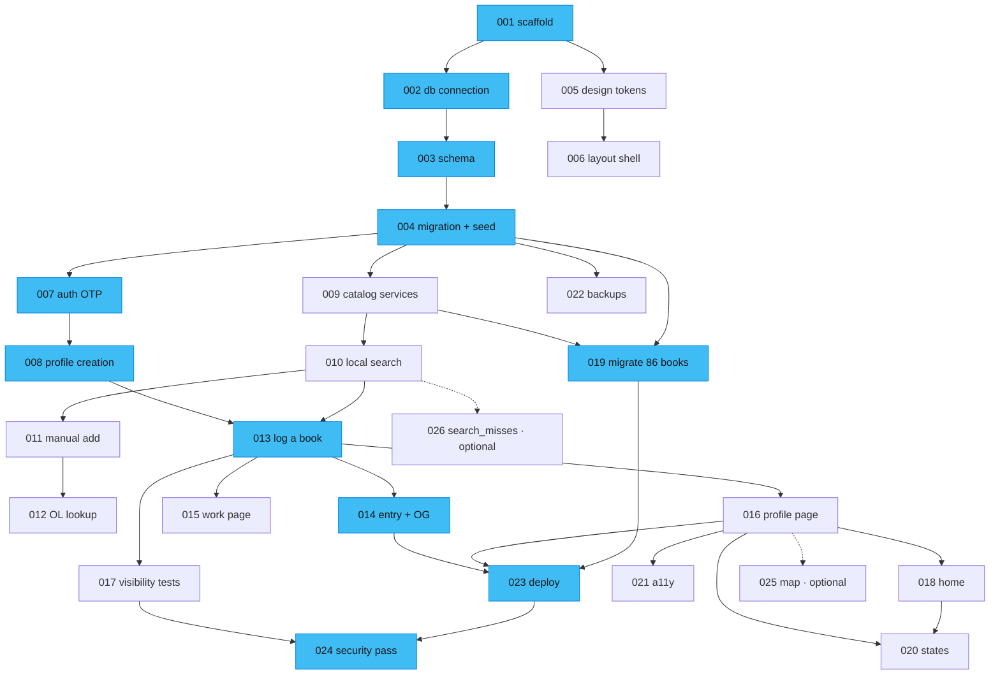

# Implementation tasks

26 tasks. Each is one clear objective, 30 minutes to a few hours, independently reviewable and objectively verifiable.

**Read [../README.md](../README.md) first.** The two blocking questions in [../open-questions.md](../open-questions.md) were settled on 2026-09-19 — Q2 resolved, Q1's risk accepted with a mitigation due before [023](023-deploy-to-vercel.md). 001 is complete.

---

## Task list

| # | Task | Phase | Est. | Depends on |
|---|---|---|---|---|
| [001](001-scaffold-nuxt-project.md) | Scaffold the Nuxt 4 project | 0 Foundation | 2h | — |
| [002](002-database-connection.md) | Neon + Drizzle connection | 1 Data | 1h | 001 |
| [003](003-define-schema.md) | Define the Drizzle schema | 1 Data | 3h | 002 |
| [004](004-initial-migration-and-genre-seed.md) | Initial migration + genre seed | 1 Data | 2h | 003 |
| [005](005-port-design-tokens-and-components.md) | Port design tokens and base components | 0 Foundation | 4h | 001 |
| [006](006-layout-and-routing-shell.md) | Layouts and routing shell | 0 Foundation | 2h | 005 |
| [007](007-auth-email-otp.md) | better-auth + email OTP + allowlist | 2 Identity | 4h | 004 |
| [008](008-profile-creation.md) | Profile creation and handle selection | 2 Identity | 3h | 007 |
| [009](009-catalog-services.md) | Catalog services + ISBN normalisation | 3 Catalog | 3h | 004 |
| [010](010-local-search.md) | Local catalog search | 3 Catalog | 3h | 009 |
| [011](011-manual-add-book.md) | Manual add-book flow | 3 Catalog | 4h | 010 |
| [012](012-open-library-lookup.md) | Open Library optional lookup | 3 Catalog | 3h | 011 |
| [013](013-log-a-book.md) | Log a book: create, edit, delete | 4 Reading | 4h | 008, 010 |
| [014](014-entry-permalink-and-og.md) | Entry permalink + Open Graph | 5 Distribution | 3h | 013 |
| [015](015-work-page.md) | Work page | 5 Distribution | 2h | 013 |
| [016](016-profile-page.md) | Profile page | 5 Distribution | 4h | 013 |
| [017](017-visibility-enforcement.md) | Visibility enforcement + tests | 4 Reading | 3h | 013 |
| [018](018-home-page.md) | Home page + recent entries | 5 Distribution | 2h | 016 |
| [019](019-migrate-livros-json.md) | Migrate the 86 books | 6 Content | 4h | 009, 004 |
| [020](020-empty-error-loading-states.md) | Empty, error and loading states | 7 Polish | 3h | 016, 018 |
| [021](021-accessibility-pass.md) | Accessibility pass | 7 Polish | 3h | 016 |
| [022](022-backup-workflow.md) | Backup workflow + tested restore | 7 Hardening | 2h | 004 |
| [023](023-deploy-to-vercel.md) | Deploy to Vercel | 7 Hardening | 2h | 014, 016, 019 |
| [024](024-security-hardening-pass.md) | Security hardening pass | 7 Hardening | 3h | 017, 023 |
| [025](025-reading-map.md) | Reading map *(should-have)* | 8 Optional | 4h | 016 |
| [026](026-search-misses-instrumentation.md) | `search_misses` instrumentation | 8 Optional | 1h | 010 |

Roughly 74 hours of focused work — about four weeks part-time.

---

## Dependency graph



## Critical path

```
001 → 002 → 003 → 004 → 007 → 008 → 013 → 014 → 023 → 024
```

Plus **019** (migration), which gates 023 because the first visitor must not land in an empty site.

Eleven tasks, roughly 30 hours. Everything else parallelises around it.

**004 is the real bottleneck.** Auth, catalog, migration and backups all unblock from it. Get the schema right and reviewed before building on it — it is the one thing here that is genuinely expensive to change later.

## Parallelisable work

| After | You can run in parallel |
|---|---|
| 001 | **005 → 006** (frontend) alongside **002 → 003 → 004** (data). No shared files |
| 004 | **007** (auth), **009** (catalog), **022** (backups) — three independent tracks |
| 009 | **019** (migration) runs alongside the whole auth track |
| 013 | **014, 015, 016, 017** are four independent pages/concerns |
| 016 | **020, 021, 025** |

With two people: one takes 002→004→007→008, the other 005→006→009→010→011. They meet at 013.

---

## Phases

| Phase | Tasks | Ends when |
|---|---|---|
| 0 Foundation | 001, 005, 006 | Nuxt runs, tokens ported, layouts exist |
| 1 Data | 002, 003, 004 | Schema is live in Neon with genres seeded |
| 2 Identity | 007, 008 | A real person can sign in and own a handle |
| 3 Catalog | 009–012 | A book can be found or added |
| 4 Reading | 013, 017 | A book can be logged, and privacy holds |
| 5 Distribution | 014, 015, 016, 018 | Links preview correctly in WhatsApp |
| 6 Content | 019 | The 86 books are live |
| 7 Hardening | 020–024 | Deployed, backed up, verified |
| 8 Optional | 025, 026 | Should-haves, if time allows |

---

## Conventions every task assumes

- TypeScript `strict: true`. `npm run typecheck` passes before every commit.
- `npm run lint` passes — including the `v-html` ban and the `no-restricted-imports` rule keeping `db` out of `app/`.
- **Reviews are plain text.** `v-html` appears nowhere, ever.
- Every read of `reading_logs` goes through `visibleLogs(viewer)`. `Viewer` is a required parameter.
- Zod validates every request body, server-side, regardless of client validation.
- UI strings are pt-BR. Error codes are snake_case Portuguese.
- Migrations are generated, committed, and applied manually from a laptop — never from CI.
- One task, one commit (or one PR). If a task needs a second commit, it was too big.

Full conventions in [../../CLAUDE.md](../../CLAUDE.md).

---

## Verifying a task is done

Every task file ends with objective acceptance criteria. "Search works well" is not a criterion; "given the query `dostoievski`, the response contains the work whose author slug is `fiodor-dostoievski`, in under 150 ms" is.

If you cannot tell from a task file how another engineer would verify it, the task file is wrong — fix it before implementing.
